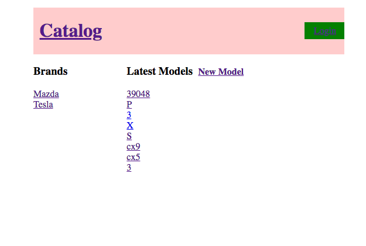

# Car Catalog
Website for cataloging cars. Users can sign in through their Google accounts via OAuth2.0 and can perform CRUD functions.

## Installation
1) Make sure you have the virtual machine environment set up.
  - Follow the link to help set up your VM if you haven't already:
    https://www.vagrantup.com/
2) Navigate to the vagrant directory in the terminal
3) Execute ‘vagrant up’ then ‘vagrant ssh’ in the terminal

```linux
vagrant up
vagrant ssh
```

4) Navigate to the vagrant folder within the virtual environment after logging in

```linux
cd /vagrant
```

5) Locate the 'catalog' folder and ensure the following most important files are there:
  - application.py
  - data.py
  - database_setup.py
6) Within your virtual machine, run 'data.py'

```linux
python data.py
```

7) Afterwards, run 'application.py'

```linux
python application.py
```
8) Your webpage should be up and running on your local machine! Go ahead and open it in a browser

## Usage Example


## Author
Steven Huynh https://www.linkedin.com/in/stevenhuynh17/
